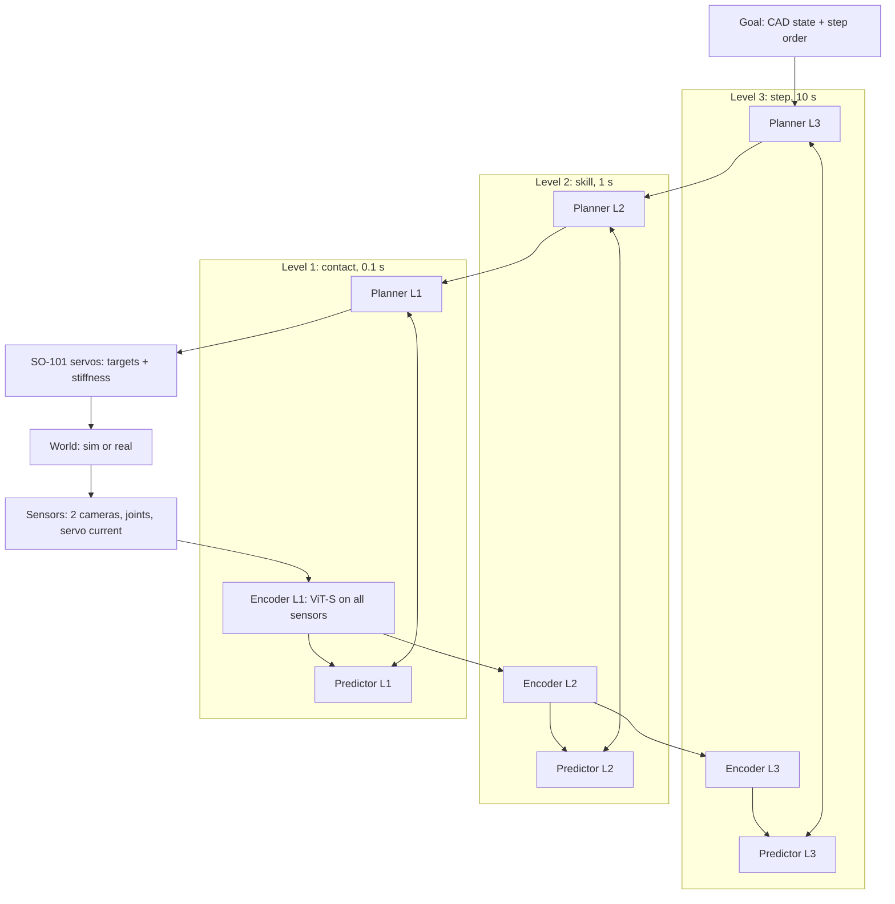

# so101-jepa plan

Written in ASD-STE100 (Simplified Technical English).

## 1. North star

An SO-101 arm learns to assemble another SO-101 arm.

- Along the way: the robot first assembles a robot-friendly SO-101 (chamfers, snap-fits, fixtures).
  The stock SO-101 (74 screws, 6 cables) is the final test (decision of 2026-10-06).
- The system is JEPA. A JEPA world model and a planner control the arm. A small actor can propose
  start plans, but the world model and the cost select the action (decision of 2026-10-06). No VLA.

## 2. Rules: how we leave local maxima

1. One ladder metric: the highest rung (section 6) that passes on the test trials. We do not
   polish a rung that passes. (Skunkworks: reach went from 81% to 97%; pick-and-place stayed at 0%.)
2. Each assumption (section 5) has a test that can kill it. Each week, we test at least one.
3. We run 2 or 3 alternatives at small scale in parallel on the fleet, not one at a time.
4. Stop rule: if a rung stays stuck for 3 tries, we stop and do a first-principles review. We
   record it in section 8. You challenge me, and I challenge you.
5. We set each pass mark before the test. If we change a pass mark after a test, we write why,
   and we do the test again on new trials.
6. We select settings on the tuning trials (seeds 1000 to 4999). We report results on the test
   trials (seeds 5000 and higher). We compare two settings on the same trials (paired), with a 95%
   interval.
7. Sim first. Our software does not move the real arm before the sim test of that rung passes.
8. The safety checks use only kinematics and fixed limits, not the world model. A person stays at
   the power switch when the real arm can move.
9. Lean code. When an experiment concludes, we record the result in section 9 and delete its code.
10. The fleet first. I tell you the cost before I rent a GPU.

## 3. Task facts

- One follower arm: 6 STS3215 servos (1/345 gears), 11 horns, 74 screws (50 M3x6, 24 M2x6) and
  6 three-pin cables ([LeRobot SO-101 guide](https://huggingface.co/docs/lerobot/so101)).
- Servo backlash: approximately 0.9 degrees (measured; the datasheet gives 0.5 or less). This is
  several mm at the gripper. Screws need sub-mm alignment.
- Each servo reports position, speed, load (register 60) and current (register 69). The current
  is a touch sensor at no cost.
- The SO-101 URDF and MJCF models are official (SO-ARM100, `Simulation/SO101`).
- Real data: approximately 23k community SO-100 episodes (the 481 datasets of SmolVLA). Your
  leader-arm demos after the build.
- Printer: AnkerMake M5, 235 x 235 mm bed, PLA+. Print the gauge files first.

## 4. Architecture

| Part | What | Why (task fact) |
|---|---|---|
| Sensors | Wrist camera, scene camera, 6 joint positions, 6 servo currents | The wrist view makes small parts large. The current shows contact. |
| Encoder L1 | Trainable ViT-S on all sensors, output: a few latent tokens | Many parts at the same time. Frozen tokens did not show a 2.5 cm cube (skunkworks). |
| Predictor L1 | Action-conditioned transformer, 0.1 s steps | Contact dynamics. |
| Actions L1 | Joint moves and servo stiffness (P gain or torque limit), in chunks | No inverse kinematics. Compliance for insertion. |
| Levels 2 and 3 | Encoders pool the latents of the level below; learned macro-actions (H-JEPA) | About 100 operations: skills (1 s) and assembly steps (10 s). |
| Goal | CAD state of each step, rendered with randomization; order from the official guide, checked by disassembly in sim | We do not learn what we already know. |
| Training | All levels end-to-end: prediction + SIGReg + inverse dynamics; an ensemble of predictors | Contacts jam or slip: the ensemble gives uncertainty. |
| Planner | Top-down (H-JEPA). The actor proposes candidates, with random ones; multi-start gradient descent (or Gauss-Newton) refines them; the lowest cost plus an uncertainty penalty wins; receding horizon | Fast plans on a small GPU. |
| Safety | An independent client checks each move with its own arm model and fixed limits | The world model can be wrong. |

Learning loop: randomized sim, community data, your demos and your assembly videos (no actions)
→ train → practice in sim (tasks with the most ensemble disagreement; hindsight goals; the robot
disassembles its work to reset the task) → the real arm, after the build. Every new episode goes
back into the data.

## 5. Assumption register

| # | Assumption | Test that can kill it | Status |
|---|---|---|---|
| A1 | A hierarchy helps assembly. | Flat LeWM against 2- and 3-level H-JEPA, same sim trials, rungs 2 to 6. | Open |
| A2 | A trainable encoder is better for control than a frozen one. | Frozen V-JEPA 2.1 tokens against a trainable ViT-S, rung 2. | Open |
| A3 | A few latent tokens are better than one vector when many parts are present. | One CLS vector against K tokens, rungs 2 and 6. | Open |
| A4 | Servo current adds contact information. | With and without current, rung 3. | Open |
| A5 | Models trained in sim transfer to the real SO-101. | Offline on community real data; then real rungs 1 and 2. | Open |
| A6 | CAD renders are good goals for real images. | Latent distance between a render and a photo of the same state, against a 1 cm change. | Open |
| A7 | Multi-start gradient descent plans well on our models. | Gradient descent, CEM and Gauss-Newton: same model, same trials. | Open |
| A8 | The actor makes plans faster with no loss of success. | Planner with and without actor proposals, same compute. | Open |
| A9 | Ensemble disagreement selects useful practice. | Against uniform tasks, same compute (paper 2610.02159). | Open |
| A10 | Stiffness in the action helps insertion. | With and without stiffness control, rung 3. | Open |
| A11 | Closed-loop vision and chamfers give sub-mm alignment with this arm. | Rung 3 success against chamfer size, in sim, then real. | Open |
| A12 | One arm and printed fixtures are sufficient. | Rungs 4 to 6 with fixtures. If they fail for lack of a second hand, we build a second follower. | Open |
| A13 | Assembly videos with no actions improve the upper levels. | L3 prediction of step results, with and without video pretraining. | Open |

## 6. The ladder

Each rung passes in sim first, then on the real arm. The pass marks are proposals. We fix each one
before its first test.

| Rung | Task | Sim pass mark (proposal) |
|---|---|---|
| 1 | Reach to a goal image | 90 of 100 test trials within 1 cm |
| 2 | Pick and place with only the final goal image | 30 of 50 |
| 3 | Put a servo into its housing | 30 of 50 fully in (within 1 mm of the CAD pose) |
| 4 | Press a horn onto a servo | 30 of 50 |
| 5 | One fastener (snap-fit first, then a screw with a tool) | 30 of 50 |
| 6 | One joint sub-assembly | 10 of 20 |
| 7 | The full robot-friendly arm | 5 of 10 |
| 8 | Rungs 1 to 7 on the real arm | Set before each test |
| 9 | The stock SO-101 | Set before the test |

## 7. Phases

### Phase 0: sim only, while the parts print (2026-10-06 to 2026-10-20)
1. Simulator test. MuJoCo, ManiSkill and Isaac Lab each put an STS3215 into its SO-101 housing
   (clearance from the CAD), 100 random starts, scripted insertion. Measure: stable contact,
   physics steps per second, render speed, and setup work on the fleet. Select one.
2. SO-101 scene: official MJCF, table, cubes, wrist and scene cameras. Randomize textures,
   light, camera pose, servo backlash (0.9 degrees) and friction.
3. Scripted data: 1,000 or more reach and pick-and-place episodes. Make the episodes long, because
   the upper levels need long windows (H-JEPA failed on short Push-T episodes).
4. Train a flat LeWM and a 2-level H-JEPA (H-JEPA code). Offline tests: the rank of the expert's
   move among random moves, and the plan direction (skunkworks tests).
5. Community data: train on the 23k SO-100 episodes. Test on held-out episodes (A5, offline part).
6. Closed loop in sim: rung 1, then rung 2 with only the final goal image.
7. You: print the parts (gauge files first). Record a video when you assemble the arm (scene
   camera and top camera). This is real assembly data (A13).

### Phase 1: the real arm (after the build)
1. Safety client and arm model for the SO-101. Fault tests in sim first.
2. Teleoperation data with the leader arm: the rung 1 and 2 tasks, and free play.
3. Real rungs 1 and 2. Then the next rung that passed in sim.

## 8. Decisions and reviews

| Date | Decision |
|---|---|
| 2026-10-06 | North star: an SO-101 assembles an SO-101. The robot-friendly SO-101 first, the stock arm last. |
| 2026-10-06 | An actor is permitted, but only as a proposer. The world model and the cost select the action. |
| 2026-10-06 | New repository (this one). The lessons of skunkworks carry over as methods, not as code. |

## 9. Results log

| Test | Date | Result |
|---|---|---|

## 10. Prior evidence

- Skunkworks (frozen V-JEPA 2.1, WidowX AI, sim): the bilinear model with Gauss-Newton reached 97
  of 100 (1-move plans); 3-move plans 24 of 100. Pick-and-place grasped in 9 of 17 trials, with
  hand-made sub-goals. With only the final goal, the gripper never came near the cube. The L1 token
  distance does not measure progress. The frozen tokens do not show a 2.5 cm cube.
- H-JEPA ([2610.06805](https://arxiv.org/abs/2610.06805)): learned hierarchy, multi-start gradient
  descent planner. AntMaze 18 to 73%, Cube 32 to 63%. DROID (open-loop) 33.6 to 38.4. Deep
  hierarchies failed on Push-T (short episodes). Closed loop on a real robot: not yet shown.
- LeVJEPA ([2608.27395](https://arxiv.org/abs/2608.27395)): video encoder with SIGReg, 5.6 to 20.8
  times less compute than V-JEPA 2. No robot results. Its gripper probe errors were larger than
  those of V-JEPA 2.1 in skunkworks.
- LpWM ([2608.22764](https://arxiv.org/abs/2608.22764)): sparse latents help small predictors;
  plans with CEM. In skunkworks, an LpWM-type model overfit 100 real episodes.
- The planning-limits paper (2609.39235): a latent distance plans reliably only 5 to 10 steps ahead.
- NVIDIA Factory, IndustReal and AutoMate: contact-rich assembly learned in sim transferred to real
  arms (reinforcement learning policies).
