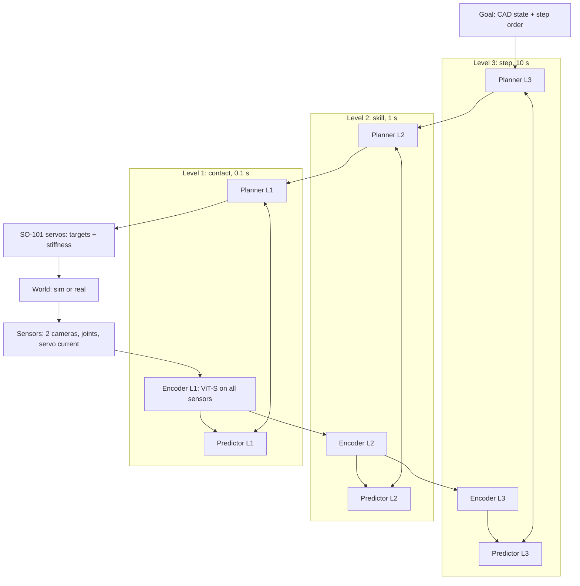

# so101-jepa plan

Written in ASD-STE100 (Simplified Technical English).

## 1. North star

An SO-101 arm learns to assemble another SO-101 arm.

- Along the way: the robot first assembles a robot-friendly SO-101 (chamfers, snap-fits, fixtures).
  The stock SO-101 (74 screws, 6 cables) is the final test (decision of 2026-10-06).
- The system is JEPA. A JEPA world model and a planner control the arm. A small actor can propose
  start plans, but the world model and the cost select the action (decision of 2026-10-06). No VLA.

## 2. Rules: how we leave local maxima

1. One ladder metric: the highest rung (section 6) that passes on the test trials. We do not
   polish a rung that passes. (Skunkworks: reach went from 81% to 97%; pick-and-place stayed at 0%.)
2. Each assumption (section 5) has a test that can kill it. Each week, we test at least one.
3. We run 2 or 3 alternatives at small scale in parallel on the fleet, not one at a time.
4. Stop rule: if a rung stays stuck for 3 tries, we stop and do a first-principles review. We
   record it in section 8. You challenge me, and I challenge you.
5. We set each pass mark before the test. If we change a pass mark after a test, we write why,
   and we do the test again on new trials.
6. We select settings on the tuning trials (seeds 1000 to 4999). We report results on the test
   trials (seeds 5000 and higher). We compare two settings on the same trials (paired), with a 95%
   interval.
7. Sim first. Our software does not move the real arm before the sim test of that rung passes.
8. The safety checks use only kinematics and fixed limits, not the world model. A person stays at
   the power switch when the real arm can move.
9. Lean code. When an experiment concludes, we record the result in section 9 and delete its code.
10. The fleet first. I tell you the cost before I rent a GPU.
11. Learning and search before human knowledge (the bitter lesson; Noah, 2026-10-07). Each
    hand-made part (a cost, a state, a sub-goal, a skill, a data source) is a debt: it has an entry
    in section 5 with a test that replaces it by a learned part. Safety checks (rule 8) and test
    measures stay hand-made.

## 3. Task facts

- One follower arm: 6 STS3215 servos (1/345 gears), 11 horns, 74 screws (50 M3x6, 24 M2x6) and
  6 three-pin cables ([LeRobot SO-101 guide](https://huggingface.co/docs/lerobot/so101)).
- Servo backlash: approximately 0.9 degrees (measured; the datasheet gives 0.5 or less). This is
  several mm at the gripper. Screws need sub-mm alignment.
- Each servo reports position, speed, load (register 60) and current (register 69). The current
  is a touch sensor at no cost.
- The SO-101 URDF and MJCF models are official (SO-ARM100, `Simulation/SO101`).
- Real data: approximately 23k community SO-100 episodes (the 481 datasets of SmolVLA). Your
  leader-arm demos after the build.
- Printer: AnkerMake M5, 235 x 235 mm bed, PLA+. Print the gauge files first.

## 4. Architecture

Every trained model has a name and a version (SO-JEPA vN). The registry is MODELS.md.

| Part | What | Why (task fact) |
|---|---|---|
| Sensors | Wrist camera, scene camera, 6 joint positions, 6 servo currents | The wrist view makes small parts large. The current shows contact. |
| Encoder L1 | Trainable ViT-S on all sensors, output: a few latent tokens | Many parts at the same time. Frozen tokens did not show a 2.5 cm cube (skunkworks). |
| Predictor L1 | Action-conditioned transformer, 0.1 s steps | Contact dynamics. |
| Actions L1 | Joint moves and servo stiffness (P gain or torque limit), in chunks | No inverse kinematics. Compliance for insertion. |
| Levels 2 and 3 | Encoders pool the latents of the level below; learned macro-actions (H-JEPA) | About 100 operations: skills (1 s) and assembly steps (10 s). |
| Goal | CAD state of each step, rendered with randomization; order from the official guide, checked by disassembly in sim | We do not learn what we already know. |
| Training | All levels end-to-end: prediction + SIGReg + inverse dynamics; an ensemble of predictors | Contacts jam or slip: the ensemble gives uncertainty. |
| Planner | Top-down (H-JEPA). The actor proposes candidates, with random ones; multi-start gradient descent (or Gauss-Newton) refines them; the lowest cost plus an uncertainty penalty wins; receding horizon | Fast plans on a small GPU. |
| Safety | An independent client checks each move with its own arm model and fixed limits | The world model can be wrong. |

Learning loop: randomized sim, community data, your demos and your assembly videos (no actions)
→ train → practice in sim (tasks with the most ensemble disagreement; hindsight goals; the robot
disassembles its work to reset the task) → the real arm, after the build. Every new episode goes
back into the data.

## 5. Assumption register

| # | Assumption | Test that can kill it | Status |
|---|---|---|---|
| A1 | A hierarchy helps assembly. | Flat LeWM against 2- and 3-level H-JEPA, same sim trials, rungs 2 to 6. | Open. Debt (rule 11): H-JEPA's structure is hand-set (2 levels, a 1 s level-2 stride, 8-d macro-actions, a 4-step level-2 horizon). A21 replaces the fixed levels and strides by one predictor that learns any time step. Our code has no hand-made sub-goals (level 2 makes them; skunkworks used hand sub-goals). |
| A2 | A large encoder pretrained on video (LeVJEPA ViT-L/16, public weights, frozen) is better for control than our small encoders trained from scratch. | Step 1: re-render the val episodes at 224x224 per view and probe frozen LeVJEPA tokens for the grasp point and the resting cube (A15 mark: 2 cm). Step 1b: LeVJEPA as a video encoder (clips of the last 4 frames) against one frame and a static clip, on motion targets (grasp-point and cube velocity, joint velocities, previous action); the motion advantage is video better than both, paired over the test episodes. Step 2, if step 1 passes: a predictor and value on frozen LeVJEPA latents against our best from-scratch version, offline tests and rung 2. Then fine-tuned against frozen. | Step 1, V-JEPA 2.1 (MIT; National Compute, 2026-10-09; hjepa/a2_encoders.sh): frozen g (1 B) and G (2 B) miss the 2 cm mark. Attentive probe: grasp point 2.38 and 2.27 cm, resting cube 3.26 and 3.29 cm (our from-scratch v31: table 3.35-3.56); mean-pooled ridge: grasp 4.06 and 3.61 cm. 2x the size gives nothing, and our small encoders trained from scratch are about as good. LeVJEPA and V-JEPA 2.1 L: kat-pc job (LeVJEPA stays off the National Compute workspace). Next (Noah, 2026-10-09): no frozen big encoder; v52 pretrains a LeVJEPA-style video encoder from scratch in our own code on all our video, then warm-starts LeWAM from it. |
| A3 | Token latents (every patch token of a frame) are better than one summary vector: they keep where things are, and more resolution gives more tokens. | SO-JEPA v6 (tokens) against v4 (one vector), same recipe otherwise: probe (A15 mark), offline tests, rung 2 (paired). | Open. v6 built and tested on the CPU (2026-10-07); trains after v4. |
| A4 | Servo current adds contact information. | With and without current, rung 3. | Open |
| A5 | Models trained in sim transfer to the real SO-101. | Offline on community real data; then real rungs 1 and 2. | Open |
| A6 | CAD renders are good goals for real images. | Latent distance between a render and a photo of the same state, against a 1 cm change. | Open |
| A7 | Multi-start gradient descent plans well on our models. | Gradient descent, CEM and Gauss-Newton: same model, same trials. | Open |
| A8 | The actor makes plans faster with no loss of success. | Planner with and without actor proposals, same compute. | Open |
| A9 | Ensemble disagreement selects useful practice. | Against uniform tasks, same compute (paper 2610.02159). | Open |
| A10 | Stiffness in the action helps insertion. | With and without stiffness control, rung 3. | Open |
| A11 | Closed-loop vision and chamfers give sub-mm alignment with this arm. | Rung 3 success against chamfer size, in sim, then real. | Open |
| A12 | One arm and printed fixtures are sufficient. | Rungs 4 to 6 with fixtures. If they fail for lack of a second hand, we build a second follower. | Open |
| A13 | Assembly videos with no actions improve the upper levels. | L3 prediction of step results, with and without video pretraining. | Open |
| A14 | Dense Gaussian latents (SIGReg) are a good choice for planning; sparse latents (LpWM: RDMReg to a rectified Laplace, RepReLU heads) are not better. | LpWM against LeWM: same data, encoder, predictor and trials; each with gradient descent and CEM; offline tests and rungs 1 and 2 (rule 6, paired). If LpWM wins, a dense control with the same heads (Identity link, Gaussian target) tells if sparsity or the heads give the gain. | Open. Flat models, 2026-10-07: LpWM a little better at short horizons (offline rank at 0.2 and 1 s; rung 1 100/100 against 97/100, p = 0.25), a little worse at 3 s; rung 2 0/50 for both. Confounded: both image latents are blind (A15). Test again with the A15 fix. |
| A15 | The world-model loss makes the image latent keep what the actions change (the arm, and the cube when the arm moves it). | Linear probe of the image latent on held-out episodes (hjepa/probe.py). Pass mark (set 2026-10-07, before the variants): grasp point and resting cube both within 2 cm RMS. | Killed for SO-JEPA v1 and v2 (joint angles in the latent) (12 to 13 cm; chance 12.8). In test: SO-JEPA v3 (vision only) and v4 (vision only plus endpoint inverse dynamics, arXiv 2610.07540). |
| A16 | The predictor keeps the cube when the gripper holds and hides it (grasp and carry), not only the encoder. | After A15 passes: roll the predictor 1 to 5 steps (0.2 to 1 s) with the true actions from held-out frames, and apply the probe fitted on encoder latents to the predicted latents, on the frames where the cube is lifted. Control: the same probe on a copy of the last latent (no motion). Pass mark: at 1 s, the cube error from predicted latents is below the copy control and within 1.5 times the encoder's own error. | Open (arXiv 2610.07355: a frozen V-JEPA 2 predictor loses a carried object although its encoder has it) |
| A17 | Vision only is enough: the model needs no joint angles as input (Noah's default bet, 2026-10-07: the bitter lesson). | After A15 passes: the vision-only model against the same model with joint angles added (with EP-IDM, and joint angles dropped in part of the batches so vision cannot be bypassed), rungs 2 and 3. Rung 3 also tests if 64x128 images give the precision insertion needs. | Open. Default: vision only (SO-JEPA v3 and later). |
| A18 | Our methods get better with scale (the bitter lesson): more data, a larger model and more planning compute give more success. | The best vision-only version on 25, 50 and 100% of sim-2; ViT-tiny against ViT-small (v12); 3 against 10 epochs (v11); CEM with 100, 300 and 1,000 samples. Probe and rung 2 for each. A flat curve kills it: something hand-built caps the method. | Open. Started 2026-10-07 on the MI355X node (v11, v12). |
| A19 | Data that needs no human expert is enough: play data (motor babbling, sim/collect.py play) and the planner's own trials toward goals sampled from earlier data (sim/self_play.py), with no scripted expert. | (a) v21 trains on play data only (sim-3); probe on sim-2 val against v6. (b) Self-improvement rounds: model k plays toward sampled goals, its trials join the data, model k+1 trains; probe and rung 2 per round. (c) Same compute: N planner-trial episodes against N more expert episodes. | Open. The default data is still the scripted expert (hand-written waypoints and grasp heights), a debt under rule 11. Part (a) is done: v21 trained on play data only (7.34 cm on the expert val set; play data has few grasps). Part (b) is in progress: round 1 is queued as v43. Part (c) is not run. |
| A20 | A learned goal-reaching value (hjepa/value.py: hindsight goals, -1 per step, expectile regression, no task labels) is a better planning cost than the latent distance to the goal image. | Same world model, same trials: latent distance against the value (SO-JEPA v5 against v4, v7 against v6): offline expert rank at 1 and 3 s, then rung 2. Val checks of the value: rank correlation with the true steps to the goal, and the nearer state has the larger value. | Open. Code ready (2026-10-07). |
| A21 | One predictor conditioned on the time step (Δt) is better than fixed time steps (5 Hz) and H-JEPA's fixed levels and strides. | Train with a random stride per clip (1 to 10 steps, the actions of the stride as input, Δt by AdaLN); the planner searches the stride. Against v6 and the 2-level H-JEPA: offline rank at 1, 3 and 10 s, rung 2. | Open. Debt (rule 11): the step and the hierarchy are hand-set. |
| A22 | Planner settings found by search on the tuning seeds are better than hand-set ones (horizon 5, 300 samples, 30 kept, 30 rounds, replan every 2 steps). | Random search on tuning seeds 1000-4999 (rule 6), scored by rung success then error; the best setting against the hand-set one on the test seeds. | Open. Debt (rule 11). |
| A23 | Training settings found by search are better than hand-set ones: loss weights (SIGReg 0.08, inverse dynamics 100, EP-IDM 10), learning rate 5e-4, weight decay 1e-4, batch 128. A learning-rate-free optimizer (schedule-free AdamW or Prodigy) removes the learning rate. | Random search (v13-v20: loss weights; then lr, weight decay, batch), scored by the probe (A15 mark); the optimizer test against the best searched lr. | Open. Loss-weight search started 2026-10-07 (v13-v20). Debt (rule 11). |
| A24 | Real community SO-100/SO-101 episodes (community-1: 441 datasets, human teleoperation) improve the sim model. | Train on community-1 + sim-2 against sim-2 only; probe on sim-2 val and offline tests on held-out community setups. The data loader handles the camera difference (one 64x64 view against two 64x128 views). | Tested once, not settled. v30 trained on sim-2 plus community-1: 5.68 cm on sim val, with half the steps from community data. The offline tests on held-out community setups and the transfer to the real arm are not done. |
| A25 | One JEPA trained end to end on next-latent prediction, goal-conditioned action flow matching and SIGReg (LeWAM, Fu, Siebert, Halicki, Balestriero 2026) is better than our world model with CEM: its action head proposes plans and gradient steps through its own dynamics refine them. | v47: LeWAM's code (third_party/lewam, MIT) on sim-2, both views, vision only; rungs 1 and 2 on the test seeds with the action head alone and with the gradient planner, against v6 and v31 with CEM; probe on sim-2 val. | Open. 2026-10-09/10 (National Compute, MODELS.md v47-v53): the head works after a warm start from the authors' Cube checkpoint (v47b: reach median 4.8 cm) or 50 epochs from scratch (v49: 6.7 cm); pick 0 for all so far. Measure with the offline action check (hjepa/lewam_check.py, held-out val episodes) and the closed loop, not LeWAM's val loss: its train/val split is by start point, so val frames come from training episodes and lewam_best.pt cannot show overfitting (v47-v51, v47c). From v53 our runs split by episode (hjepa/lewam_common.py). Why the paper scores far higher (Cube reactive 99%): its test starts at a step of a training episode (sim state set) with the goal the frame 25 steps later on that trajectory, the true horizon given, budget 50, hand within 4 cm; ours are new scenes, goals off the expert trajectories up to 20 chunks away (pick: 60), the horizon guessed, a 1 cm bar (v47b under 4 cm: 34% head alone, 73% gradient planner). Also 5.6x less data (360k frames; Cube ~2.0 M), ~14x fewer steps (50k; ~700k), joint-delta not end-effector actions, 64 px views. Next: rung 0, LeWAM's own protocol in our sim, to tell the model from the task. |
| A26 | A hierarchical LeWAM (H-JEPA levels, each a LeWAM: state stream plus a flow-matching action head) is better than flat LeWAM on long tasks (rung 2, 300 steps; LeWAM's own long-horizon result is 46%): level 1 acts in 1 s chunks toward a goal latent, level k+1 runs on a ~5x slower clock and its action head proposes level k's subgoal latent; one encoder, trained jointly; no planner needed, gradient refinement optional at every level (Noah's aim, 2026-10-09). | v49: N levels against flat v47/v48 on rungs 1 and 2, same data, with three ways to set each level's time step: (a) fixed strides (1 s / 5 s / 25 s; 2 and 3 levels); (b) learned per decision: the action head proposes (subgoal latent, Δt) jointly by flow matching, on the time-step predictor of A21, trained with hindsight goals at random distances, and the gradient planner or the value (A20) prefers good Δt (imitation alone learns only the data's Δt spread); (c) boundaries where the level below starts to predict badly (surprise). After A25 shows LeWAM works on our arm. | Open. |

## 6. The ladder

Each rung passes in sim first, then on the real arm. The pass marks are proposals. We fix each one
before its first test.

| Rung | Task | Sim pass mark (proposal) |
|---|---|---|
| 1 | Reach to a goal image | 90 of 100 test trials within 1 cm (fixed 2026-10-06, see below) |
| 2 | Pick and place with only the final goal image | 30 of 50 (fixed 2026-10-06, see below) |
| 3 | Put a servo into its housing | 30 of 50 fully in (within 1 mm of the CAD pose) |
| 4 | Press a horn onto a servo | 30 of 50 |
| 5 | One fastener (snap-fit first, then a screw with a tool) | 30 of 50 |
| 6 | One joint sub-assembly | 10 of 20 |
| 7 | The full robot-friendly arm | 5 of 10 |
| 8 | Rungs 1 to 7 on the real arm | Set before each test |
| 9 | The stock SO-101 | Set before the test |

Sim tests of rungs 1 and 2 (fixed 2026-10-06, before the first test; sim/closed_loop.py):
- Rung 1: the goal is an observation (scene and wrist views, joint angles) of the arm at a random
  reachable pose, gripper pointing down, 4 to 20 cm above the table. Success: the grasp point ends
  within 1 cm of the goal's grasp point after 100 steps (20 s). Test trials: seeds 5000 to 5099.
- Rung 2: the goal is an observation of the cube at a new place (6 cm or more away) and the arm at
  its rest pose. No sub-goals. Success: after 300 steps (60 s) the cube is within 2 cm (xy) of the
  goal place and rests on the table. Test trials: seeds 5000 to 5049.
  Deviation (2026-10-08, Noah's decision, rule 5): the mark also requires a real pick and place
  (success_strict in sim/closed_loop.py): the cube was held off the table, then released, and it
  rests, settled, on the table at the end. A cube pushed along the table into the goal place passed
  the old definition (Codex audit, finding 8). The mark stays 30 of 50. Earlier rung 2 results (0 of
  50, never lifted) fail both definitions, so none changes.
- We tune on seeds 1000 to 4999. We compare flat LeWM and 2-level H-JEPA on the same test trials.
- Change (2026-10-06, before any test): cubes and goal places are 15 to 25 cm from the arm's base
  (was 15 to 28 cm), within +-60 degrees. Past 26 cm the arm is almost straight, and the scripted
  expert, which knows the true state, lifted the cube in only 43 of 99 tries (sim/expert_eval.py).

## 7. Phases

### Phase 0: sim only, while the parts print (2026-10-06 to 2026-10-20)
1. Simulator test. MuJoCo, ManiSkill and Isaac Lab each put an STS3215 into its SO-101 housing
   (clearance from the CAD), 100 random starts, scripted insertion. Measure: stable contact,
   physics steps per second, render speed, and setup work on the fleet. Select one.
2. SO-101 scene: official MJCF, table, cubes, wrist and scene cameras. Randomize textures,
   light, camera pose, servo backlash (0.9 degrees) and friction.
   Deviation (2026-10-06): the scene is in MuJoCo before step 1 ends. Rungs 1 and 2 do not depend
   on insertion physics, and MuJoCo has the official SO-101 model. If another simulator wins
   step 1, rungs 3 and higher move to it.
3. Scripted data: 1,000 or more reach and pick-and-place episodes. Make the episodes long, because
   the upper levels need long windows (H-JEPA failed on short Push-T episodes).
4. Train a flat LeWM, a flat LpWM (A14) and a 2-level H-JEPA (H-JEPA code). Offline tests: the
   rank of the expert's move among random moves, and the plan direction (skunkworks tests).
5. Community data: train on the 23k SO-100 episodes. Test on held-out episodes (A5, offline part).
6. Closed loop in sim: rung 1, then rung 2 with only the final goal image. The flat models plan
   with gradient descent and with CEM (A7, A14).
7. You: print the parts (gauge files first). Record a video when you assemble the arm (scene
   camera and top camera). This is real assembly data (A13).

### Phase 1: the real arm (after the build)
1. Safety client and arm model for the SO-101. Fault tests in sim first.
2. Teleoperation data with the leader arm: the rung 1 and 2 tasks, and free play.
3. Real rungs 1 and 2. Then the next rung that passed in sim.

## 8. Decisions and reviews

| Date | Decision |
|---|---|
| 2026-10-06 | North star: an SO-101 assembles an SO-101. The robot-friendly SO-101 first, the stock arm last. |
| 2026-10-06 | An actor is permitted, but only as a proposer. The world model and the cost select the action. |
| 2026-10-06 | New repository (this one). The lessons of skunkworks carry over as methods, not as code. |
| 2026-10-06 | Noah: try LpWM again. The skunkworks test (2026-10-03) was not decisive: frozen V-JEPA 2.1 encoder, 100 real episodes (it overfit), gradient planner only, offline tests only. Here it is trained end to end, in sim, with both planners and the closed-loop rungs (A14). |
| 2026-10-07 | Rung 2 failed (try 1): the image latent is blind (probe, A15). H-JEPA and community training are held, since they share the encoder. Noah: the goal is an SO-101 that picks up a block and moves it to a target position, with a full JEPA stack (no VLM or VLA); I decide the experiments. Next: encoder variants against A15's pass mark, then rung 2, then H-JEPA. |
| 2026-10-07 | Noah: name and version every model. Family SO-JEPA X.Y: X changes with the interface (inputs, actions, latent shape, levels), Y with any other recipe change. Registry and dataset IDs: MODELS.md. LeWM and LpWM are 1.0 and 1.1; variants A and E are 2.0 and 2.1. |
| 2026-10-07 | Noah: vision only is the default bet (the bitter lesson). The model sees only the cameras; the joint encoders stay in the servo loop that does the actions (A17). |
| 2026-10-07 | Noah: remove human knowledge and structure wherever we can (rule 11). First: token latents in place of the CLS summary (A3, SO-JEPA v6) and a learned goal-reaching value in place of the hand-set latent distance (A20). Next debts: the scripted expert as the data source (A19) and hand sub-goals (A1, H-JEPA). |
| 2026-10-07 | Versions follow the model-registry convention (MLflow and others): SO-JEPA v1, v2, v3 in order of submission, with the lineage in MODELS.md. SemVer does not fit: its promise is compatibility, and every retraining changes the latent space. Old 1.0, 1.1, 2.0, 2.1, 2.2, 3.0, 3.1 are now v1 to v7. |

## 9. Results log

| Test | Date | Result |
|---|---|---|
| Step 1: CAD geometry (bakeoff/geometry.py) | 2026-10-06 | The STS3215 slides into the SO-101 base along one axis. The CAD has zero clearance on 4 faces (0.05 mm overlap from tessellation), so the test makes the servo smaller by 0, 0.2 and 0.4 mm per side. Convex pieces (CoACD, threshold 0.01, at most 64 vertices; 191 base pieces) reach up to 0.19 mm into the pocket (p99 0.13 mm); threshold 0.03 reached 0.59 mm. |
| Step 1: MuJoCo 3.14 insertion (600 trials, bakeoff/insert_mujoco.py) | 2026-10-06 | 0.4 mm, aligned hand: 100 of 100 in (median error 0.13 mm). 0.4 mm, perturbed (1.5 mm, 2 degrees): 4 of 100. 0.2 and 0 mm: 0 of 400 (the servo jams 5.5 mm in; the 0.19 mm decomposition error is the probable cause at 0.2 mm). No unstable trial; deepest penetration 0.34 mm. 7,100 physics steps/s (4,800 when seated, one laptop core). Render on Iris Xe (EGL): 160 fps at 64x64, 148 fps at 480x640. |
| Step 1: ManiSkill engine, SAPIEN 3 PhysX CPU (600 trials, bakeoff/insert_maniskill.py) | 2026-10-06 | 0 of 600 in, at every clearance. With the PhysX defaults, velocity spikes (unstable trials) and 2-7 mm penetration; the best of 4 settings (TGS, 0.5 mm contact offset, slow push-out) removed the spikes, but PhysX then reported contact depths of 31-35 mm, which are not physical for a 45 mm servo: a fault in our PhysX setup or in its convex-piece handling, not found yet. 6,000 physics steps/s. Render 1,393 fps at 64x64 (8 times MuJoCo), 168 fps at 480x640. |
| Step 1: Isaac Lab (exact-mesh SDF contact; bakeoff/insert_isaaclab.py) | 2026-10-06 | Not run: needs a Linux RTX GPU (Brev paused by Noah). Script and setup are written, not tested. |
| Step 1: decision | 2026-10-06 | MuJoCo, provisionally: the only simulator that inserted the servo and stayed physical. Open: Isaac Lab's SDF contact, and an exact-mesh contact in MuJoCo (SDF plugin), to remove the decomposition error that blocks the 0.2 mm case. |
| Step 1: why MuJoCo jammed at 0.2 mm (bakeoff/path_check.py) | 2026-10-06 | A static check along the insertion path: the CAD meshes never overlap at 0.2 mm clearance, but the convex pieces overlapped by 0.18 mm from 6 mm in, where the servo jammed (0.05 mm from the base split, 0.09 mm from the servo split). A finer base split alone (CoACD 0.005, 984 pieces) removed the base part and still jammed (0 of 20). With the servo split also finer (0.01, 616 pieces) the pieces overlap 0.001 mm, and MuJoCo inserts at 0.2 mm: 20 of 20, aligned hand (median error 0.07 mm). The cause was the convex split, not MuJoCo's contact. These parts are now the default (bakeoff/parts). Physics: 1,000-3,200 steps/s (more pieces). The perturbed hand (1.5 mm, 2 degrees) still fails at every clearance: a hand-strategy problem for rung 3. |
| Step 1: both simulators again with the fine parts (100 trials per case) | 2026-10-06 | MuJoCo: 0.2 and 0.4 mm with the aligned hand, 100 of 100 each (median error 0.07 mm); perturbed hand 2 and 1 of 100; 0 mm (the CAD's zero clearance) 0 of 100; 1 unstable trial in 600. In 14 of the 100 trials at 0.2 mm, one pair of pieces (base_41, servo_166) reports a contact depth of 6.4 mm in the last 0.3 mm before the seat, where the CAD has zero gap at the pocket's end wall; the median deepest contact per trial is 0.011 mm and every trial seats, so this is a depth artifact of that pair, not a physics failure. 1,000-3,200 steps/s. ManiSkill (PhysX): 0 of 600 again, now with 9 mm reported depths; the PhysX fault is not in the parts. Decision unchanged: MuJoCo. Open: Isaac Lab (GPU), a hand that corrects 1.5 mm errors. |
| Step 2: SO-101 scene (sim/scene.py, env.py) | 2026-10-06 | Official SO-101 MJCF. The jaw collision hulls fill the gap between the fingers (the cube cannot enter), so box pads on the measured finger faces replace them. Wrist camera at the front of the camera module, aimed between the fingers; scene camera above and in front. Randomized per episode: camera pose (+-2 cm), light, table and cube colour, cube friction, joint offsets (+-0.45 degrees, calibration and backlash), servo gain (+-20%). |
| Step 3: expert and collector (sim/expert.py, collect.py) | 2026-10-06 | 60 s play episodes at 5 Hz: pick-and-place (60%), reach (25%), free motion (15%). In the 3 checked episodes the expert lifts the cube 11-12 cm and places it. Data: 64x128 frames (scene and wrist), joints, joint-target changes, and the true state for tests; about 10 KB per step. Speed: 40 steps/s per process on a Linux laptop, 280 on kat-pc (GPU rendering). |
| Step 3: expert test at scale (sim/stats.py, expert_eval.py) | 2026-10-06 | The first 1,300-episode dataset was faulty. Over 5,063 pick-and-place tries the expert lifted the cube in 66% and placed it within 2 cm in 40% (the 3 checked episodes had hidden this). Causes: (1) the grasp target was 1.2 cm too low: the finger pads reach 25 mm past the grasp point, so the arm pressed the pads into the table and the cube slipped; (2) past 26 cm the arm is almost straight, and lifts failed in 56 of 99 tries. Fixes: grasp with the pad tips 3 mm over the table, place with the cube 2.5 mm over it, and cubes and goals 15 to 25 cm out (also for the rung 1 and 2 tests, see section 6). Fast test (100 episodes, no rendering): 88% lifted, 79% placed within 2 cm (median error 1.1 cm). The dataset was made again with the fixed expert. |
| Step 3: dataset, second build (sim/make_dataset.sh, stats.py) | 2026-10-06 | 1,200 train episodes (seeds 1,000,000 and up) and 100 val episodes (2,000,000 and up), 300 steps each: 360,000 and 30,000 steps, 3.5 and 0.3 GB (10-frame image chunks). Expert in the train data: 5,366 pick-and-place tries, 91% lifted, 83% placed within 2 cm; val: 90% and 79%. Share of steps: pick-and-place 88%, reach 7%, free motion 5%. No NaN; no dark or flat frame in 600 sampled frames per split. In 2 train episodes the cube leaves the table. 50 min on samsung-2 (14 processes). |
| Step 5: community data (community/build.py, verify.py) | 2026-10-06 | lerobot/community_dataset_v3 (revision ab92ac3f), a sample of 441 SO-100/SO-101 datasets (105 GB of video), one camera each, 5 Hz, 64x64. Test = 43 whole datasets (setups not in training). Train: 388 datasets, 13,692 episodes, 1,246,544 steps (13.5 GB); test: 1,092 episodes, 128,640 steps (1.4 GB). 10 datasets left out for data errors (black frames, frozen video, joints wrapped past 360 degrees, leader and follower calibrations that differ by 45 degrees or more). Normalization per dataset: z-scores of the joint angles (proprio) and of leader minus follower (action), with the difference wrapped to +-180 degrees, a std floor (5 and 1 degrees) and a clip at +-10; without these, 0.03% of the steps had z up to 38. Frames: 1 blank and 2 green ones among 5,000 random train frames, none in test. |
| GPU for steps 4-6 | 2026-10-06 | Brev paused by Noah. Kaggle's weekly GPU quota is used up (32.8 h); Noah chose to wait for its reset (about 2026-10-10). Steps 4-6 wait. |
| GPU: WSL on kat-pc | 2026-10-06 | Noah approved Ubuntu 24.04 in WSL2 on kat-pc (RTX 4060 Ti, 8 GB); the fleet maintainer installed it. Jobs run through wsl.exe (hjepa/wsl_job.sh) with --gpu-gb 7 --ram-gb 20 --cpus 20. The GPU is shared with SailingGame's Unreal work, so jobs wait in the queue while it runs. |
| Training speed on kat-pc (hjepa/smoke.sh, speed.sh) | 2026-10-06 | WSL: CUDA works; MuJoCo renders only 4-5 frames/s there (no GPU EGL), enough for the closed loop (70 s per reach trial with gradient descent, 37 s with CEM). At batch 128 the models filled the 8 GB GPU and spilled into shared system memory: 70 samples/s for LeWM, 11 for H-JEPA. ViT gradient checkpointing (same recipe, extra compute) brings LeWM to 298 samples/s (2.7 GB), LpWM to 293 (2.6 GB) and H-JEPA to 180 (4.4 GB): about 3.3 h for 10 LeWM epochs and 5.3 h for H-JEPA. |
| MuJoCo renderer on kat-pc's WSL (scripts/gl_check.py, SO101Env, 64x64 views) | 2026-10-08 | Mesa's EGL used llvmpipe (CPU): 4.1 steps/s. GALLIUM_DRIVER=d3d12 renders on the RTX 4060 Ti through D3D12: 11.9 steps/s (2.9x; SailingGame shared the GPU). Pixels differ from llvmpipe: 18% of pixels, mean 0.09 grey levels, max 117. scripts/gpu.sh sets d3d12 under WSL from commit (this). Jobs queued before it keep llvmpipe. On hp-1 (llvmpipe), render is 99.6% of a step and shadows about 69% of render (perf-render branch, RENDER_HILLCLIMB.md). |
| H-JEPA on Windows | 2026-10-06 | Training stops on kat-pc: stable-pretraining uses POSIX signals (SIGUSR1). Training and planning run on Linux only. The full chain (data, training, offline tests, closed loop) passed a smoke test with a 3-step model. |
| kat-pc sharing | 2026-10-06 | SO-JEPA v1 training died at epoch 6.2 ("CUDA error: unknown error") while a SailingGame Unreal build (queued, 8 threads and 10 GB declared) ran beside it. Cause not found (no driver reset in the Windows log; RAM is probable). Noah's decision: fleet ranks projects, SailingGame first; fleet stops lower-ranked jobs and requeues them. So our jobs are stoppable and resumable: training resumes from a checkpoint (every 500 steps), the WSL side ends on a stop (tested), closed-loop runs skip finished seeds. |
| Step 4: SO-JEPA v1 training (LeWM recipe, so101_lewm) | 2026-10-06 | 10 epochs, 27,750 steps, batch 128, about 3.5 GPU hours on kat-pc (resumed once). Held-out prediction loss: 0.021 after epoch 1, 0.017 after epoch 3, then flat (0.017 at epoch 10; train 0.015): no overfit, no gain after epoch 3. Inverse dynamics 0.014 (train 0.008). SIGReg 5.4 to 3.1. The latent has mean 0 and std 1, but values up to +-15 to 20 (a Gaussian gives about +-5). |
| Step 4: SO-JEPA v1 offline tests (hjepa/offline.py; val episodes, 500 cases) | 2026-10-06 | Rank of the expert's move among 100 random moves (0 best, 0.5 chance): 0.012 +- 0.006 for a goal 0.2 s ahead, 0.21 +- 0.02 at 1 s, 0.42 +- 0.03 at 3 s. Plan direction (cosine of the first planned move with the expert's, 250 cases; the planner looks 1 s ahead even for the goal 3 s ahead): gradient descent 0.35 +- 0.06 at 1 s, 0.16 +- 0.06 at 3 s; CEM 0.40 +- 0.06 and 0.16 +- 0.06 (CEM minus gradient descent at 1 s: +0.05 [+0.01, +0.10], paired). The one-step signal is strong at 0.2 s and almost gone at 3 s. |
| Step 4: SO-JEPA v2 (LpWM recipe) offline tests (A14; same 500 cases, paired with v1) | 2026-10-07 | LpWM trained 10 epochs (stopped and resumed 4 times by fleet ranks). Expert rank: 0.002 at 0.2 s (LeWM 0.012; difference -0.010 [-0.015, -0.005]), 0.19 at 1 s (-0.019 [-0.036, -0.001]), 0.44 at 3 s (+0.016 [-0.005, +0.036]). Plan direction with CEM at 1 s: 0.45 (LeWM 0.40; +0.042 [+0.004, +0.079]); at 3 s 0.12 (LeWM 0.16; -0.044 [-0.088, -0.000]). Gradient descent: no difference. Small LpWM gains at short horizons, a small loss at 3 s. |
| Step 6: rung 1, flat models (sim/closed_loop.py, seeds 5000-5099) | 2026-10-07 | PASS (mark 90/100): SO-JEPA v1 (LeWM) gradient descent 97/100 (median error 0.30 cm), LeWM CEM 97/100, LpWM gradient descent 100/100 (0.17 cm; LpWM minus LeWM +3% [0, +7%], McNemar p = 0.25), LpWM CEM 100/100 (0.16 cm; against LeWM CEM the same +3%, p = 0.25). Not a vision test: the goal has joint angles, and the probe (below) shows the planner reaches by them. |
| Step 6: rung 2, flat models (seeds 5000-5049) | 2026-10-07 | 0/50 for SO-JEPA v1 (LeWM) and v2 (LpWM), each with gradient descent and CEM. The cube was lifted in 1 of 200 trials; median error 12.9 cm (the cube stays where it starts). Fail, try 1 of 3 (rule 4). |
| Probe of the latents (hjepa/probe.py; ridge, 20 held-out val episodes) | 2026-10-07 | The pixel latent is almost blind. RMS error of the grasp point from the pixel latent: 12.1 cm (v1), 12.4 cm (v2), against 12.8 cm for no features (R^2 0.10 and 0.05). Cube on the table: 12.6 and 13.0 cm against 12.7 cm (R^2 below 0). The full latent finds the grasp point (1.3 cm) only through the joint angles. So the encoders learned image features that do not follow the arm or the cube; rung 2 cannot work. Only 35% (LeWM) and 42% (LpWM) of the pixel latent's variance is within episodes (joint angles: 87%), so most of it is per-episode content. Probable cause: a shortcut. The joint angles already solve prediction and inverse dynamics, and per-episode features (light, colours, camera pose) are constant in an episode, so easy to predict, and spread enough for SIGReg. To test next, before H-JEPA (same encoder): within-episode variance of the pixel latent, and encoders that must use vision. |
| Image ceiling (hjepa/ceiling.py) | 2026-10-07 | A small supervised CNN (6 epochs on 120,000 train frames, 12 min on samsung-2's CPU) finds, in the 64x128 frames of the val episodes: the cube to 1.3 cm RMS, the resting cube to 1.5 cm, the grasp point to 1.3 cm (spread 12.5 cm). The frames show the cube; the blind latent comes from the objective, not the resolution. 1.5 cm is near the 2 cm marks, so resolution is a later lever. |
| GPU: National Compute node | 2026-10-07 | 8x AMD MI355X (288 GB each), 236 CPU threads, torch 2.11.0+rocm7.2 (scripts/gpu.sh picks the build; GPU.md). One GPU per model; a 3-epoch ViT-tiny model trains in 15-20 min. The CPU, not the GPU, is the limit: data loading, MuJoCo's software rendering (osmesa) and ROCm's busy wait (one core per waiting process). The first node had no GPUs (refunded). |
| Step 6: rung 1 and 2, vision-only models (CEM, seeds 5000-5099 and 5000-5049) | 2026-10-07 | Rung 1 reach: v4 96/100 (median 0.22 cm), v6 98/100 (0.19 cm), v8 92/100 (v3's seed replicate). Rung 2 pick: 0/50 for v4, v6 and v8; the cube was never lifted. The learned value as the planning cost: v5 18/100 and v7 3/100 in rung 1, worse than the latent distance. |
| Probes, attentive (hjepa/probe.py; one learned query over the tokens; val, cube on the table, RMS cm; A15 mark 2) | 2026-10-07 | v6 4.06 (rerun 3.97), v10 (seed 43) 3.81. Noise: a rerun of the probe moves it 0.1-0.2 cm, a new seed 0.25 cm, so only gaps over about 0.4 cm count. Best: v36 3.22, v35 3.32, v31 3.56. No model reaches 2 cm. |
| A21: time-step-conditioned predictor (v31, v36) | 2026-10-07 | Clips with a random stride of 1-10 steps, the stride as an input. Attentive table 3.56 and 3.22 cm (v6 and v10: 4.06 and 3.81): 0.5 cm better in 2 seeds. Jump test (hjepa/jump_test.py; time error of the best stride's prediction, 300 cases): 0.79 and 0.68 s for a 2 s jump (v6: 1.53 s), 2.16 and 1.76 s for 4 s (v6: 4.05 s). Planning with one plan per stride (so101_flat_cem_dt): reach 12/12, but 417 s per trial, so stopped. |
| A18: scale | 2026-10-07 | Data (same steps): 25% of sim-2 6.62 cm (v33), 50% 5.23 (v34), 100% 4.06 (v6): -1.3 cm per doubling, not flat. Compute: 10 epochs (v11) 5.79, no gain. Model: ViT-small (v12) 4.17, no gain. All together with A21 and 3x the steps (v35): 3.32, the same as v31 and v36. More data is the lever that works. |
| A23: learning rate, schedule and loss weights by search or learned | 2026-10-07 | Loss-weight search (v13-v20, 8 trials): 3.87-4.84 cm; learning-rate search (v23-v28, 6 trials): 4.12-6.70 cm; none beats v6. No learning rate: Prodigy (v22) 3.90 cm, Prodigy + ScheduleFree (v29) 4.04 cm: equal to the hand-set learning rate and schedule. ScheduleFree+ (v38, h_jepa/sfplus.py) diverged: the gradient clip ran before the Polyak step, which divides by the gradient norm, so steps were 30-90x too large; a fitted loss floor (v39) also diverged, but it still had the clip, so it tested nothing; the fit code is removed. Without clipping (v40) it trains: 4.57 cm (rerun 4.69), 0.5 cm behind. The schedule-free models have weaker ridge probes (6.6 cm against 5.2-5.5); recomputed BatchNorm statistics changed nothing (under 0.12 cm), so it is the averaged weights themselves. Seed replicates: Prodigy + ScheduleFree 4.89 cm (v37), ScheduleFree+ 3.64 cm (v41); ridge 6.9 and 7.6. Decision: no schedule-free optimizer (ridge worse in 4 of 4 models, ~0.9 cm seed spread against 0.25); Prodigy (no learning rate, equal on both probes) is the default from v42. |
| A19a and A24: play data and community data | 2026-10-07 | Play data only (v21): 7.34 cm on the expert val set, where the cube moves; play data has few grasps. Sim-2 plus community-1 at the same steps (v30): 5.68 cm on sim val; half the steps go to the community data. Transfer to the real arm is the real test (Phase 1). |
| A19b: self-play, round 1 | 2026-10-07 | First try: 0 episodes in 80 min. 93 self-play processes shared one GPU, and a training (v36) was on the same GPU, so both crawled (v36 at 0.1 batches/s instead of 10). Second try (round 1b): 10 processes per GPU on 8 GPUs, 9-14 min per 300-step episode, ~300 episodes; all lost at the stop: processes started in the background by sh ignore SIGINT, and the forced stop left each HDF5 shard without its index. Fixed: one file per episode, and SIGTERM ends a run cleanly. |

## 10. Prior evidence

- Skunkworks (frozen V-JEPA 2.1, WidowX AI, sim; Noah doubts its methods and results, so we treat it as
  weak evidence and test its claims again here): the bilinear model with Gauss-Newton reached 97
  of 100 (1-move plans); 3-move plans 24 of 100. Pick-and-place grasped in 9 of 17 trials, with
  hand-made sub-goals. With only the final goal, the gripper never came near the cube. The L1 token
  distance does not measure progress. The frozen tokens do not show a 2.5 cm cube.
- H-JEPA ([2610.06805](https://arxiv.org/abs/2610.06805)): learned hierarchy, multi-start gradient
  descent planner. AntMaze 18 to 73%, Cube 32 to 63%. DROID (open-loop) 33.6 to 38.4. Deep
  hierarchies failed on Push-T (short episodes). Closed loop on a real robot: not yet shown.
- LeVJEPA ([2608.27395](https://arxiv.org/abs/2608.27395)): video encoder with SIGReg, 5.6 to 20.8
  times less compute than V-JEPA 2. No robot results. Its gripper probe errors were larger than
  those of V-JEPA 2.1 in skunkworks.
- LpWM ([2608.22764](https://arxiv.org/abs/2608.22764)): sparse latents help small predictors;
  plans with CEM. In skunkworks, an LpWM-type model overfit 100 real episodes.
- The planning-limits paper (2609.39235): a latent distance plans reliably only 5 to 10 steps ahead.
- EP-IDM ([2610.07540](https://arxiv.org/abs/2610.07540), Toso, LeCun et al.): prediction plus
  SIGReg can reach its minimum while the encoder drops directions the actions control (Lemma 2; our
  probe shows this). Reconstructing the H actions from the first and last latents keeps every
  direction reachable in H steps. CartPole latent LQR 0 to 100%; Walker2D 0.08 to 2.91 m/s. Same
  small architecture as ours (ViT-tiny from scratch, AdaLN predictor, CEM 300/30). Our SO-JEPA v4.
- EpicWorldModel ([2610.05996](https://arxiv.org/abs/2610.05996)): stochastic predictor (flow
  matching, 1-2 steps) samples several futures; CEM adds an exploration bonus from their spread.
  Big gains under occlusion (RoboCasa navigation 45 to 72-90%, PointMaze Giant 65 to 86%), none on
  the OGBench manipulation scene (64 vs 60-62%). Its encoder objective is LeWM's, so it does not fix
  A15. Later use: one-model uncertainty (planner cost, A9 practice selection) and grasps that can
  succeed or slip.
- Tracking Is Not Permanence ([2610.07355](https://arxiv.org/abs/2610.07355), Xie and Alanwar):
  the frozen V-JEPA 2 predictor loses a hidden moving object within 0.3 s and keeps a stationary
  one in only 13 to 41% of scenes, but a linear probe reads the object from the encoder at 1.00.
  V-JEPA 2 and Cosmos both lose an object carried inside a moving container. 3,000 predictor-only
  steps on synthetic container scenes fix this (0.05 to 1.00). IntPhys scores rose with other
  curricula too, so the benchmark does not measure this belief. Only the mask predictor was tested,
  not V-JEPA 2-AC. For us: a cube in a closed gripper is a carried object; test the predictor, not
  only the encoder (A16). Their minimal pairs (two worlds that differ only at the object) are a
  cleaner test than a regression probe.
- NVIDIA Factory, IndustReal and AutoMate: contact-rich assembly learned in sim transferred to real
  arms (reinforcement learning policies).
- RoboJEPA ([2610.10515](https://arxiv.org/abs/2610.10515), FAIR): action-conditioned predictors
  (22M to 8B) on a frozen V-JEPA 2.1-G encoder, 15,022 h of robot video (LeRobot SO-101 included),
  CEM to one goal image. Imagination error follows a second-order power law in compute and tracks
  planning success. Real Franka, 30 episodes per task: 8B pick and place 27%, the 22M model 17%,
  so pick needs no huge model there (blocking end-effector control, 3D translation and gripper only).
  Short training rollouts (2 steps) broke long-horizon planning; 10-step rollouts fixed it. A V-JEPA
  2 encoder made the predictor collapse; V-JEPA 2.1's dense features scaled (A2). Inputs always
  include proprioception, so A17 is untested there. Weights: not released yet (2026-10-08).
- DSReg ([2610.09457](https://arxiv.org/abs/2610.09457), Zheng, Klindt, Balestriero, Schölkopf):
  a SIGReg JEPA identifies the latent state only up to a rotation, so each latent mixes world
  factors. A post-hoc rotation, chosen to make the local Jacobians d(observation)/d(latent) sparse,
  recovers individual factors when their pixel footprints differ (proof; synthetic and 64x64
  rendered scenes, N = 8 factors). For us: a rotation changes no L2 or L1 latent distance and no
  dense probe, so our CEM cost and probes stay the same; it helps only modules that read a few
  latents (a sparse cost, monitor or few-shot readout). It adds no information the latents lack (A15).
  Authors' code (github.com/kunwuz/dsreg, no licence on 2026-10-09; a Lean 4 proof of the theorem):
  synthetic nested footprints, N = 4-14, MCC 0.52-0.77 -> 0.97-0.997. hjepa/dsreg.py follows its fit
  (identity start kept unless beaten, gradient clip 10, 12 restarts x 3,000 steps); on a nested
  6-factor test it recovers the factors (MCC 0.80 -> 1.00). Our arm's joints are nested footprints too.
- RoboRender ([2610.09254](https://arxiv.org/abs/2610.09254), Stanford, Li Fei-Fei, Jiajun Wu):
  Wan2.1-T2V-1.3B fine-tuned on ~130k real robot clips (AgiBot-World, DROID) at 416x240 renders
  photoreal video of a sim trajectory, conditioned on its depth video, a robot mask video and a
  prompt; geometry, motion and actions stay the sim's. Pi0.5 policies trained only on these videos,
  zero shot on real arms (8 tasks, 10 trials each): 71% against 10% (raw sim render) and 20% (domain
  randomization); depth-only input 10-30%. More renders per sim trajectory raise success with no new
  trajectories (opening +65 points), and the mask lets it render arms it never saw (YAM, R1Pro).
  For us (A5): a learned renderer beats hand-made randomization by 3.6x (rule 11), and MuJoCo gives
  depth and robot masks for free. Our JEPA learns from pixels, so rendered sim-3 episodes would feed
  it directly; the SO-101 is an unseen arm, and the prompt is a generation input only, not in the
  model we run. Cost: 4.3 s per 3-view 81-frame clip on an H200 after distillation (DMD2, 6 steps);
  a 1.3B model at 416x240 may fit the 4060 Ti, untested. Inference code and weights are public
  (github.com/robo-render/RoboRender-Video-Model, huggingface.co/RoboRender/roborender-video), but
  the code repo has no licence (2026-10-09). Test candidate for A5, against community-1 (A24), once
  the sim rungs pass.
- LeWAM ([paper](http://minghaofu.com/files/lewam.pdf), [site](https://le-wam.github.io/), [code](https://github.com/MinghaoFu/lewam), MIT; Fu, Siebert, Halicki, Balestriero): one model, a
  ResNet-18 encoder (one 192-d latent per view, a 32-keypoint spatial softmax) and a mixture-of-transformers
  predictor with a state stream (next latent from history latents and actions) and an action stream (flow
  matching of an action chunk, conditioned on a goal latent and the horizon left), trained jointly with SIGReg;
  history latents never see the clean actions, so the policy cannot copy them. Planning: 32 head proposals
  imagined to the goal step, refined by Adam through the dynamics, cheapest wins (32x faster than CEM). Ten
  sim tasks, goal reaching: 93.5% against LeWM's 50.9% (CEM); OGBench Cube (pick and place) 100%; long
  horizon (100 steps) 46.2% against 10.9%. With the head removed, CEM on its dynamics still beats LeWM on
  Cube (86% against 64%): action learning shapes the latents (probe R2 +0.2 for joints and actions), as our
  EP-IDM. Real 7-DoF arm, scene + wrist cameras, 30 trials: pick and place 16/30, as Diffusion Policy (19)
  and better than pi0.5 (14), at 1/13 of pi0.5's compute. Our closest relative: same objective family
  (SIGReg), same data format (stable-worldmodel HDF5), same two cameras. A25 tests it here (v47).
- LeAVJEPA ([2610.06226](https://arxiv.org/abs/2610.06226), Aalto): one early-fusion ViT, LeJEPA
  objective (SIGReg, no EMA, no decoder) on audio, video and both. Modality dropout (a missing input
  is another view of the same event) is what aligns the modalities (ablation); 91.3% ESC-50 frozen.
  For us: low priority while the stack is vision only. If a second input enters (servo current, A4;
  contact sound), one encoder with input dropout is the way, and the model still runs on vision alone.
  The same dropout over our two views (scene, wrist) would let the model run with one camera.
